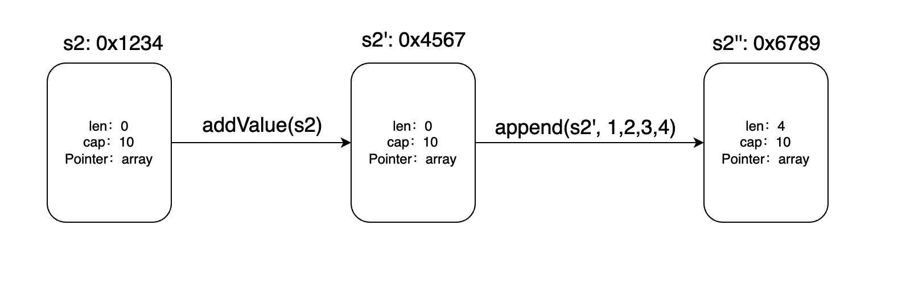
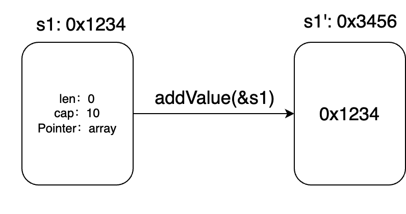
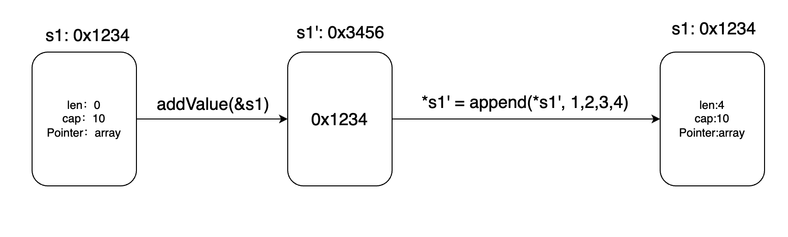

最近看一个仓库的源码时，看到下面addValue1中的“奇怪”写法。我的第一反应是这和addValue2的写法有什么区别吗？slice底层是对数组的操作，为什么还需要再多套一个slice的指针呢？

```go
func addValue1(list *[]int) {
	*list = append(*list, 1, 2, 3, 4)
}

func addValue2(list []int) {
    list = append(list, 1, 2, 3, 4)
}
```

从写法上来说，肯定有区别，形参一个是切片（指针），一个是切片的指针（指针的指针）。

那么这两种写法从功能上有什么区别吗？先来看看slice扩容的情况：

```go
func main() {
	s1 := make([]int, 0, 1)
	s2 := make([]int, 0, 1)
	addValue1(&s1)
	addValue2(s2)
	fmt.Printf("s1: %v\n", s1)
	fmt.Printf("s2: %v\n", s2)
}

func addValue1(list *[]int) {
	*list = append(*list, 1, 2, 3, 4)
}

func addValue2(list []int) {
	list = append(list, 1, 2, 3, 4)
}
```

输出结果：

```go
s1: [1 2 3 4]
s2: []
```

对于s2来说，addValue中append导致数组扩容，内部开辟新的数组，然而s2还是指向原来的旧数组。所以s2底层的数组没有变化。

再来看看数组没扩容的情况，s2是否能正确获得添加新元素后的数组呢？

```go
func main() {
	s1 := make([]int, 0, 10)
	s2 := make([]int, 0, 10)
	fmt.Printf("%p\n", s2)
	addValue1(&s1)
	addValue2(s2)
	fmt.Printf("s1: %v\n", s1)
	fmt.Printf("s2: %v\n", s2)
}

func addValue1(list *[]int) {
	*list = append(*list, 1, 2, 3, 4)
}

func addValue2(list []int) {
	list = append(list, 1, 2, 3, 4)
}
```

最终的输出：

```go
s1: [1 2 3 4]
s2: []
```

这里我们对s1和s2都初始化了长度为0容量为10的切片，并且addValue函数都是添加了4个元素，并不会扩容，那为什么s1，s2在addValue后打印出的值不同呢？

我们可以看看 s2[:4] 输出什么

```go
func main() {
	s1 := make([]int, 0, 10)
	s2 := make([]int, 0, 10)
	addValue1(&s1)
	addValue2(s2)
	fmt.Printf("s1: %v\n", s1)
	fmt.Printf("s2: %v\n", s2)
	fmt.Printf("s2[0:4]: %v\n", s2[:4])
}

func addValue1(list *[]int) {
	*list = append(*list, 1, 2, 3, 4)
}

func addValue2(list []int) {
	list = append(list, 1, 2, 3, 4)
}
```

输出结果：

```go
s1: [1 2 3 4]
s2: []
s2[0:4]: [1 2 3 4]
```

可以看到s2的底层数组是成功添加值了的。

实际上，s2的可视范围还受到len的限制，因为**go的函数传参始终是值传递**，s2的len始终为0，所以看不到底层数组的变化。如下图所示



函数调用是值传递，函数内部s2’ 是对s2的拷贝，所以函数内部的改动针对s2’，和s2无关。同样append函数之后返回一个新的s2’’，这也是为什么append的返回值必须接收。


综上两种情况：slice扩容与不扩容，都使得外部变量s2不会感知到底层数组的变化，而s1却可以。这就是切片的指针的作用。如下图：

调用addValue(&s1)时，取s1的地址，addValue函数内部`s1’` 保存的值是s1的地址。



调用`*s1' = append(*s1', 1,2,3,4)`时，append会返回一个新切片，这个新切片保存在`s1'`指向的内存中，即s1的内存中。



